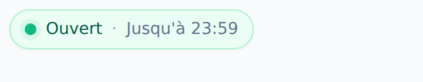
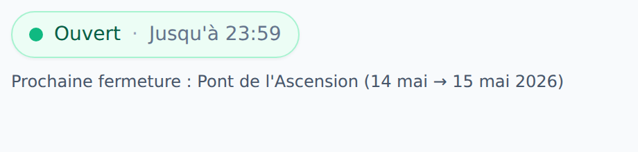

# Gestion des horaires du bureau

Application Next.js 16 + Tailwind (en français) permettant à un manager de
configurer les horaires d'ouverture habituels du bureau et les périodes de
fermeture exceptionnelles, avec une API publique pour exposer ces informations.

## Aperçu


## Stack

- **Next.js 16** (App Router, Route Handlers)
- **React 19** + **Tailwind CSS 3** (thème clair)
- **PostgreSQL** via le driver `pg` (sans ORM)
- **TypeScript**
- Pas de système d'authentification

## Démarrage rapide

1. Copier `.env.example` vers `.env` et renseigner `DATABASE_URL`.
2. Installer les dépendances :
   ```bash
   npm install
   ```
3. Initialiser la base (création des tables et insertion des 7 jours par défaut) :
   ```bash
   npm run db:init
   ```
4. Lancer le serveur de développement :
   ```bash
   npm run dev
   ```

L'interface de gestion est accessible sur http://localhost:3000.

## Schéma PostgreSQL

Voir [`src/lib/schema.sql`](src/lib/schema.sql).

| Table          | Rôle                                                    |
| -------------- | ------------------------------------------------------- |
| `regular_hours`| Une ligne par jour de la semaine (0 = dimanche … 6 = samedi). |
| `holidays`     | Périodes de fermeture (vacances, jours fériés, etc.).   |

## Interface manager

- **Statut courant** : indique si le bureau est ouvert maintenant.
- **Horaires habituels** : case à cocher par jour + heures d'ouverture/fermeture.
- **Périodes de fermeture** : ajout / suppression de périodes datées.

## API publique

Toutes les réponses sont en JSON et autorisent CORS (`*`).

### `GET /api/schedule`

Retourne les horaires hebdomadaires et les fermetures à venir.

```json
{
  "timezone": "Europe/Paris",
  "regular_hours": [
    {
      "day_of_week": 1,
      "day_label": "Monday",
      "is_open": true,
      "open_time": "09:00",
      "close_time": "18:00"
    }
  ],
  "upcoming_closures": [
    {
      "id": 3,
      "name": "Christmas break",
      "start_date": "2026-12-22",
      "end_date": "2027-01-02"
    }
  ]
}
```

### `GET /api/status`

Indique si le bureau est ouvert à l'instant donné.

Paramètres :

- `date` (optionnel) — date/heure ISO 8601. Par défaut : maintenant.

```json
{
  "checked_at": "2026-05-03T14:30:00.000Z",
  "timezone": "Europe/Paris",
  "open": true,
  "closes_at": "18:00",
  "reason": "regular"
}
```

## Widgets à intégrer

Une page dédiée `/embeds` présente les widgets disponibles avec un aperçu en
direct et un extrait `<iframe>` à copier.


| Route                       | Contenu                                                                |
| --------------------------- | ---------------------------------------------------------------------- |
| `/embed/badge`              | Badge compact Ouvert / Fermé avec heure de fermeture ou motif.         |
| `/embed/badge-holidays`     | Badge + période de fermeture en cours ou à venir dans 15 jours max.    |

Aperçus des widgets :

| Ouvert | Fermé |
| ------ | ----- |
|  |  |
|  |  |

Les widgets se rafraîchissent automatiquement toutes les 2 minutes côté client
et autorisent l'embed depuis n'importe quel domaine
(`Content-Security-Policy: frame-ancestors *`).

Exemple d'intégration :

```html
<iframe
  src="https://votre-domaine.example/embed/badge"
  width="360"
  height="56"
  loading="lazy"
  style="border:0;background:transparent"
  title="Horaires du bureau">
</iframe>
```

## API d'administration (interne)

Utilisée par l'interface de gestion.

| Méthode | Route                          | Description                                       |
| ------- | ------------------------------ | ------------------------------------------------- |
| `GET`   | `/api/admin/regular-hours`     | Liste des 7 jours.                                |
| `PUT`   | `/api/admin/regular-hours`     | Met à jour les 7 jours en bloc.                   |
| `GET`   | `/api/admin/closures`          | Liste des fermetures (`?include_past=true`).      |
| `POST`  | `/api/admin/closures`          | Crée une période de fermeture.                    |
| `DELETE`| `/api/admin/closures/:id`      | Supprime une période.                             |

> Aucune authentification n'est en place. Pour un déploiement en production,
> ajoutez un reverse proxy ou un middleware de protection devant les routes
> `/api/admin/*` et la page `/`.

## Régénérer les captures d'écran

Les captures du dossier `docs/screenshots/` sont produites par un script
Playwright. Lancez le serveur en mode production puis exécutez le script :

```bash
npm run build && npm start &
npm run screenshots
```

Variables d'environnement utiles : `SCREENSHOT_BASE_URL` (défaut
`http://localhost:3000`) et `CHROMIUM_PATH` (chemin vers un binaire Chromium
si vous ne souhaitez pas utiliser celui géré par Playwright).
